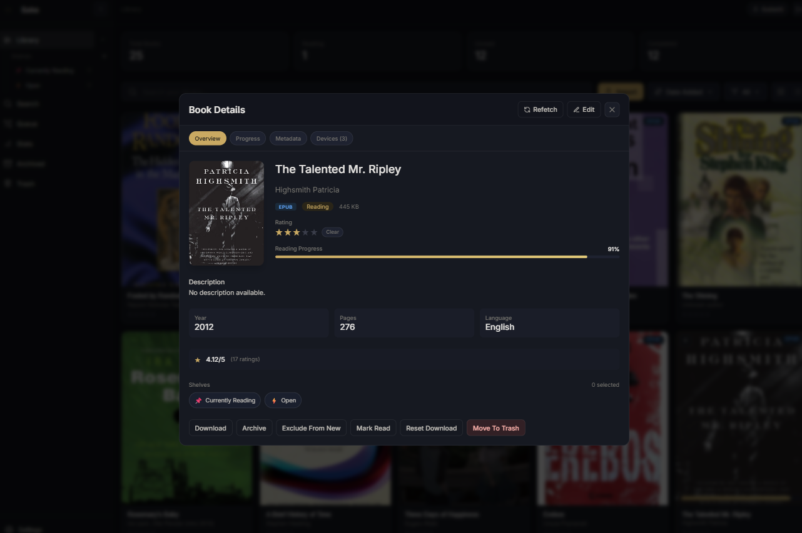
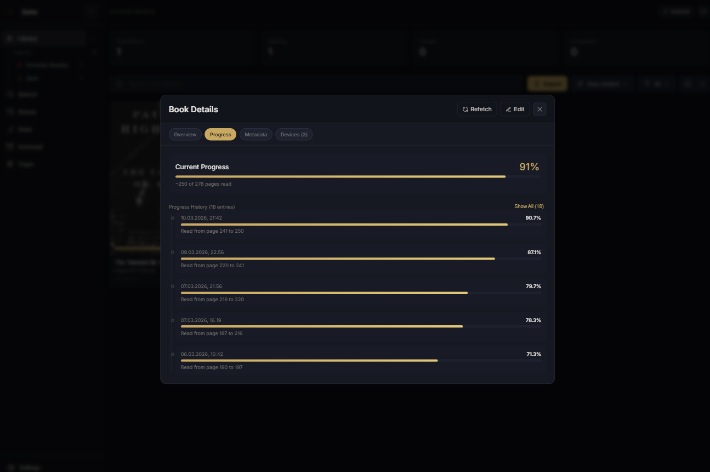

# Sake

Sake is a small personal reading stack built around a Svelte web app and a KOReader plugin.

The idea is simple: keep your library in one place, sync reading progress between devices, and make the KOReader workflow less annoying.

## What is in this repo?

- `sake/` - the main web app and API (`Svelte 5` + `SvelteKit`)
- `koreaderPlugins/` - the KOReader plugins used by Sake

## Features

- Personal reading hub for managing books, metadata, shelves, ratings, and reading state
- KOReader integration for syncing books, progress, and plugin updates across devices
- Provider-based search with direct download or import into your library
- Local account auth plus device API keys for secure browser and device access
- Self-hostable stack with libSQL and S3-compatible storage
- Built to keep your library, progress, and KOReader workflow in one place

## Usage

### Fully Selfhosted with Docker

Use `sake/.env.docker.selfhosted`. The included `docker-compose.selfhost.yaml` brings up the web app, a local file-backed libSQL database, SeaweedFS as the S3-compatible storage layer, and a migrator that applies schema changes on startup.

Example env:

```env
LIBSQL_URL=file:/data/sake.db
LIBSQL_AUTH_TOKEN=

S3_ENDPOINT=http://seaweedfs:8333
S3_REGION=us-east-1
S3_BUCKET=sake
S3_ACCESS_KEY_ID=sakeadmin
S3_SECRET_ACCESS_KEY=sakeadminsecret
S3_FORCE_PATH_STYLE=true

AWS_ACCESS_KEY_ID=sakeadmin
AWS_SECRET_ACCESS_KEY=sakeadminsecret
AWS_DEFAULT_REGION=us-east-1

ACTIVATED_PROVIDERS=openlibrary,gutenberg
# GOOGLE_BOOKS_API_KEY=
```

Start it from the repository root:

```bash
docker compose -f docker-compose.selfhost.yaml up --build
```

Then open `http://localhost:5173`.

### WebApp selfhosted and external db and storage

This is the preferred setup if you want to self-host only the Sake web app while using external managed infrastructure. Turso works great as a free libSQL host, and Cloudflare R2 works great as a free S3-compatible bucket host.

Use `sake/.env.docker.managed`.

Example env:

```env
LIBSQL_URL=libsql://your-database-name.turso.io
LIBSQL_AUTH_TOKEN=your-turso-auth-token

S3_ENDPOINT=https://<account-id>.r2.cloudflarestorage.com
S3_REGION=auto
S3_BUCKET=your-bucket-name
S3_ACCESS_KEY_ID=your-r2-access-key-id
S3_SECRET_ACCESS_KEY=your-r2-secret-access-key
S3_FORCE_PATH_STYLE=false

ACTIVATED_PROVIDERS=openlibrary,gutenberg
VITE_ALLOWED_HOSTS=
# GOOGLE_BOOKS_API_KEY=
```

Then start the app from the repository root:

```bash
docker compose up --build
```

This stack runs the web app plus a migrator container. Your database and bucket stay external.

### Without Docker

Without Docker, always use `sake/.env`.

Managed example for `sake/.env`:

```env
LIBSQL_URL=libsql://your-database-name.turso.io
LIBSQL_AUTH_TOKEN=your-turso-auth-token

S3_ENDPOINT=https://<account-id>.r2.cloudflarestorage.com
S3_REGION=auto
S3_BUCKET=your-bucket-name
S3_ACCESS_KEY_ID=your-r2-access-key-id
S3_SECRET_ACCESS_KEY=your-r2-secret-access-key
S3_FORCE_PATH_STYLE=false

ACTIVATED_PROVIDERS=openlibrary,gutenberg
VITE_ALLOWED_HOSTS=
# GOOGLE_BOOKS_API_KEY=
```

Fully selfhosted example for `sake/.env`:

```env
LIBSQL_URL=file:./sake-selfhosted.db
LIBSQL_AUTH_TOKEN=

S3_ENDPOINT=http://localhost:8333
S3_REGION=us-east-1
S3_BUCKET=sake
S3_ACCESS_KEY_ID=sakeadmin
S3_SECRET_ACCESS_KEY=sakeadminsecret
S3_FORCE_PATH_STYLE=true

ACTIVATED_PROVIDERS=openlibrary,gutenberg
VITE_ALLOWED_HOSTS=
# GOOGLE_BOOKS_API_KEY=
```

Make sure your database and S3-compatible storage are reachable from the host, then start the app:

```bash
cd sake
bun install
bun run db:migrate
bun run dev
```

If you are not starting through Docker Compose, run `bun run db:migrate` once before first boot and again after future schema changes.

Then open `http://localhost:5173`.

## How to use the KOReader plugin

1. Install the plugin as any other (by moving it into the plugin folder)

2. Go to settings -> more tools


3. Select "Sake"


4. Set the public URL where you host the webapp (eg. sake.yourdomain.com)

5. Set the username and passowrd (the same login data as the webapp)

6. Press "Login and fetch device key". This will fetch an api key, store it, and clear the password from your device

7. Press Sync books to download all the books in your sake library

8. Enjoy!


Optionally you can export the current ebooks to the Webapp. This will take all books in the home folder and it's subfolders and upload them. The sidecar file for progress and notes is also exported.

## How to enable downloads via Z-Library

At the top of the page there is a button "Connect Z-Library". You need to either login with e-mail and password (will not get stored) or login yourself on the official z-library page and copy th remix_userkey and remix_userid out of your cookies. 

When logging in with your password the app simply makes a post request to the login page and sets the cookies for the remix values in your browser. These values get used to make authenticated requests to z-library, so your password is safe.

Make sure that the provider is enabled first, add `zlib` as value in active providers

`ACTIVATED_PROVIDERS=zlib`

## Tips

- Sake will download new books automatically if you set your device to sleep
- Right now, book progress needs to be synced manually with "Sync progress now"
- On Startup, if the version number of the sake plugin gets checked. If a version increase is detected it will be uploaded to the object storage and the "check for updates" button can be used to automatically download and install the update. This is a easy way to tweak the plugin and get it onto your device.


## A few images

### Webapp





### KOReader Plugin


## Notes

- Database migrations live in `sake/` and are managed with Drizzle.
- KOReader plugin releases are served by the `sake` app, while plugin artifacts are stored in S3-compatible object storage.
- API route lookup is available in the app at `/api/_routes` and `/api/docs`.
- A self-host reference stack is available at `docker-compose.selfhost.yaml`.

## License

This repository is licensed under `AGPL-3.0-only`.
See `LICENSE` for the full text.
