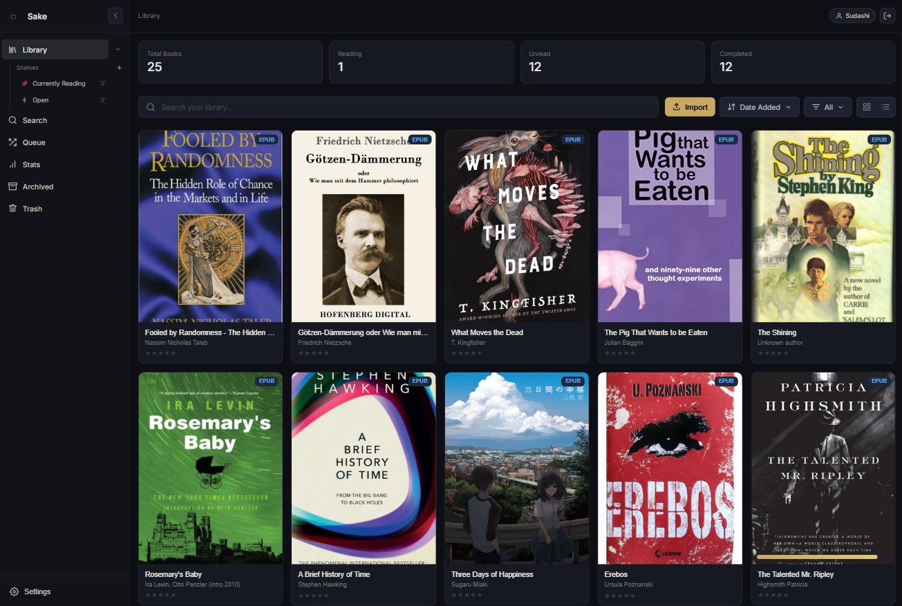
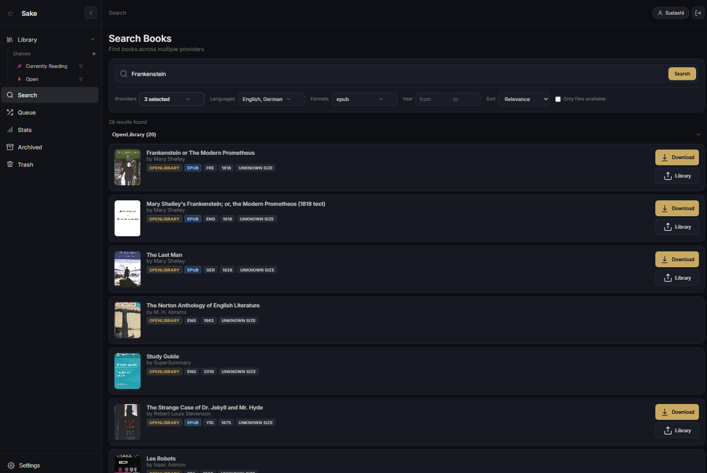

# Sake

Sake is a self-hostable reading stack built around a Svelte web app and a KOReader plugin.

It keeps your library, reading progress, and device sync in one place, with optional search/download providers for importing books into your collection.

## What lives in this repo?

This repository has two important layers:

- `sake/` - the actual SvelteKit app (`Svelte 5` + `SvelteKit` + `Bun`)
- `koreaderPlugins/` - the KOReader plugin shipped by the app
- `docs/` - shared project documentation and screenshots

If you are working on the app itself, run app commands from `sake/`.

## What Sake does

- Manage a personal library with metadata, shelves, ratings, and reading state
- Sync KOReader devices with the web app
- Keep reading progress and sidecar data in sync
- Import books through provider-based search and download flows
- Serve KOReader plugin updates from the same stack
- Run on libSQL plus S3-compatible object storage

## Choose a setup

### 1. Self-hosted reference stack

Use this if you want the easiest all-in-one setup for local or personal self-hosting.

It uses:

- `docker-examples/docker-compose.prebuilt.selfhost.yaml` for the published image path
- `docker-compose.selfhost.yaml` at the repository root
- `sake/.env.docker.selfhosted`
- a file-backed libSQL database
- SeaweedFS as the S3-compatible storage example
- a one-shot migrator container that applies schema changes before the app starts

From the repository root with the prebuilt image:

```bash
docker compose -f docker-examples/docker-compose.prebuilt.selfhost.yaml up
```

Or build it locally from source:

```bash
docker compose -f docker-compose.selfhost.yaml up --build
```

Then open `http://localhost:5173`.

Data is persisted under:

- `./.data/selfhost/libsql`
- `./.data/selfhost/seaweedfs`

### 2. Docker app container with external database/storage

Use this if you want to run only the Sake containers but keep your database and object storage elsewhere, for example:

- Turso for libSQL
- Cloudflare R2 or another S3-compatible storage provider

Edit `sake/.env`, then start from the repository root with the prebuilt image:

```bash
docker compose -f docker-examples/docker-compose.prebuilt.yaml up
```

Or build it locally from source:

```bash
docker compose up --build
```

This Compose stack runs:

- `sake-migrator` first (`bun run db:migrate`)
- `sake` after the migration succeeds

Then open `http://localhost:5173`.

### 3. Local Bun development without Docker

Use this if you are developing the app locally and already have a reachable database and S3-compatible storage.

Configure `sake/.env`, then run from `sake/`:

```bash
bun install
bun run db:migrate
bun run dev
```

Then open `http://localhost:5173`.

If you are not using Docker Compose, run `bun run db:migrate` before first boot and again after future schema changes.

### 4. Pin a prebuilt image version

Published images live at `ghcr.io/sudashiii/sake`.

Available tags:

- `latest`
- `<version>` where `<version>` matches the existing CalVer without the `webapp/v` prefix
- `sha-<shortsha>`

Example:

```bash
SAKE_IMAGE=ghcr.io/sudashiii/sake:2026.03.28.1 docker compose -f docker-examples/docker-compose.prebuilt.yaml up
```

## Configuration

Copy `sake/.env.example` to `sake/.env` and fill in the values you need.

### Required groups

- `LIBSQL_*` - database connection
- `S3_*` - S3-compatible object storage connection

### Optional values

- `VITE_ALLOWED_HOSTS` - comma-separated host overrides for Vite/dev setups
- `ACTIVATED_PROVIDERS` - comma-separated search providers
- `BODY_SIZE_LIMIT` - upload/body size limit

If `ACTIVATED_PROVIDERS` is unset, blank, or contains no valid values, search stays disabled and the search UI remains hidden.

Accepted provider names:

- `anna`, `annas`, `annas-archive`, or `annasarchive`
- `openlib` or `openlibrary`
- `gutenberg`
- `zlib` or `zlibrary`

### Example: managed infrastructure

```env
LIBSQL_URL=libsql://your-database-name.turso.io
LIBSQL_AUTH_TOKEN=your-turso-auth-token

S3_ENDPOINT=https://<account-id>.r2.cloudflarestorage.com
S3_REGION=auto
S3_BUCKET=your-bucket-name
S3_ACCESS_KEY_ID=your-access-key-id
S3_SECRET_ACCESS_KEY=your-secret-access-key
S3_FORCE_PATH_STYLE=false

ACTIVATED_PROVIDERS=anna,openlib,gutenberg
VITE_ALLOWED_HOSTS=
BODY_SIZE_LIMIT=Infinity
```

### Example: fully self-hosted

```env
LIBSQL_URL=file:./sake-selfhosted.db
LIBSQL_AUTH_TOKEN=

S3_ENDPOINT=http://localhost:8333
S3_REGION=us-east-1
S3_BUCKET=sake
S3_ACCESS_KEY_ID=sakeadmin
S3_SECRET_ACCESS_KEY=sakeadminsecret
S3_FORCE_PATH_STYLE=true

ACTIVATED_PROVIDERS=anna,openlib,gutenberg
VITE_ALLOWED_HOSTS=
BODY_SIZE_LIMIT=Infinity
```

## First boot

If the database is empty, Sake exposes the normal bootstrap flow in the UI so you can create the first account there. You do not need to predefine a user in the environment.

## KOReader plugin

The KOReader plugin lives in `koreaderPlugins/sake.koplugin`.

Basic setup flow:

1. Install the plugin in KOReader like any other plugin.
2. Open `Settings -> More tools -> Sake`.
3. Set the public URL of your Sake web app.
4. Log in with the same username and password you use in the web app.
5. Choose `Login and fetch device key`.
6. Use the sync actions to pull books, push progress, or check for plugin updates.

The login step exchanges your password for a device API key and clears the password from the device afterward.

You can also export ebooks from the devices home folder back to the web app, including sidecar data such as progress and notes. Great if you have a pre-existing library on your device!

KOReader plugin releases are tracked in the database and the artifacts are served through S3-compatible storage. If the KOReader plugin is updated and you start the app, the new version will be uploaded to S3 so you can use the updater plugin to easily update the core plugin without needing to manually mvoe the files to your KOReader device.

### Concrete Usage
- The Plugin can be found under "Settings" --> "More tools" --> "Sake"
- Books are are downloaded when pressing "Sync Books now" or when setting the device to sleep
- The progress gets automatically uploaded when putting the device to sleep and you are currently in the book (dont exit the book!)
- If you use multiple devices, the progress needs to be manually downloadede with the "Sync progress now" button. (I had problems getting background sync to work, but im still working on it!)
- Pressing "Export Existing Library" tries to upload every book and progress sidecar to the WebApp. This takes a while and the E-Reader is not usable before finishing!
- Before using it you need to set the API URL (base url like, sake.yourdomain.com) and login to fetch the API Key. Your password will be removed from the device after logging in.
- You can optionally change the auto generated device name. The device name will show up in the WebApp in the API-Key list and on the Book Detail you ("Downloaded on device x)

## Search providers and downloads

Search is provider-based and routed through `POST /api/search`.

- `anna`, `openlibrary`, and `gutenberg` work as normal providers once enabled in `ACTIVATED_PROVIDERS`
- `zlibrary` also requires you to connect your Z-Library session in `Settings -> Logins`

To enable Z-Library support, add it to `ACTIVATED_PROVIDERS`:

```env
ACTIVATED_PROVIDERS=zlib,anna,openlib,gutenberg
```

In the app UI, open `Settings -> Logins`, then use `Connect Z-Library` and either:

- log in with your email and password, or
- copy `remix_userid` and `remix_userkey` from your Z-Library cookies

The app uses those session values for authenticated Z-Library requests.

## Useful commands

Run these from `sake/`:

```bash
bun run dev
bun run build
bun run preview
bun run check
bun run test
bun run db:generate
bun run db:migrate
bun run db:status
```

From the repository root, these compose entry points are available:

- `docker-compose.yaml` for a managed source build
- `docker-compose.selfhost.yaml` for a self-hosted source build
- `docker-examples/docker-compose.prebuilt.yaml` for a managed prebuilt image
- `docker-examples/docker-compose.prebuilt.selfhost.yaml` for a self-hosted prebuilt image

## Screenshots

### Web app




### KOReader plugin


## License

This repository is licensed under `AGPL-3.0-only`.
See `LICENSE` for the full text.
